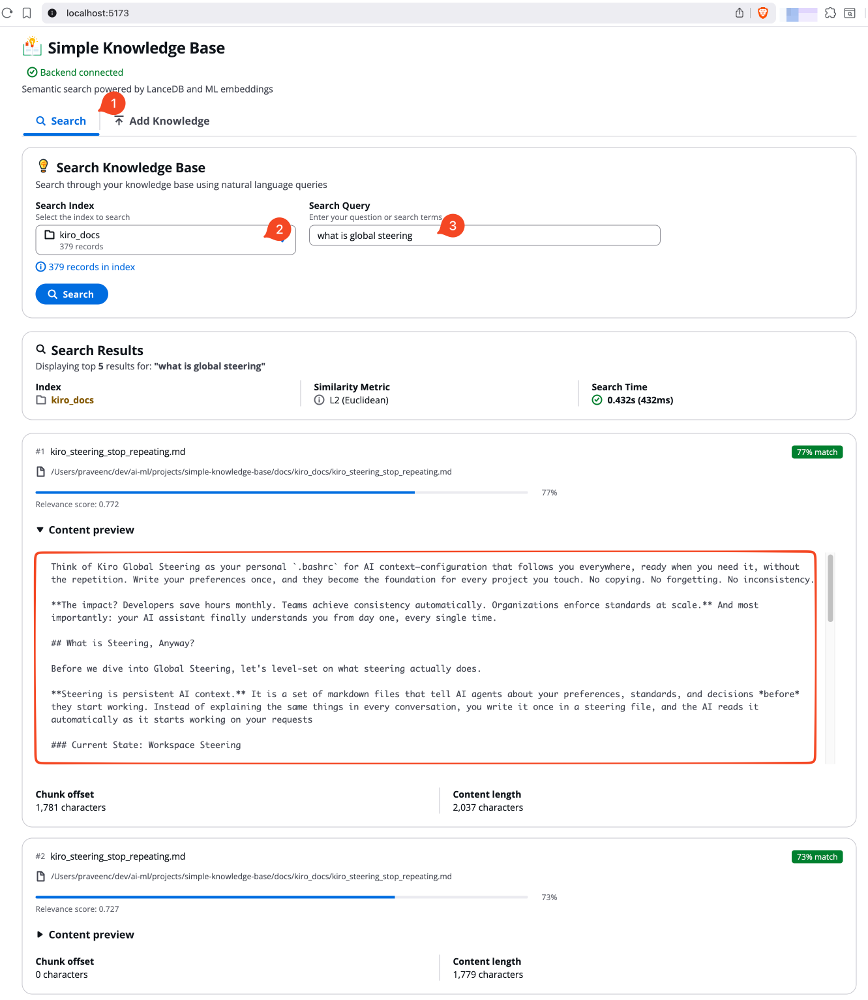
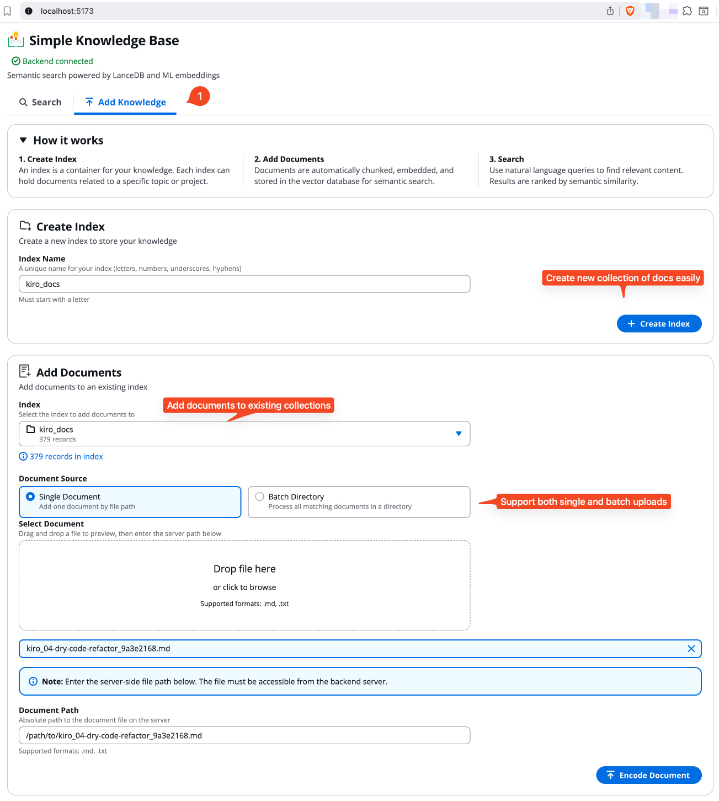

# simple-knowledge-base

[](https://www.python.org/downloads/)
[](https://fastapi.tiangolo.com)
[](https://react.dev)
[](https://lancedb.com)
[](LICENSE)

**A simple, local-first semantic knowledge base.**

Add your documents. Search with natural language. Find what matters.

simple-knowledge-base uses semantic chunking and vector embeddings to understand your documents, not just match keywords. Results are reranked for relevance, so the best answers surface first.

## ✨ Features

- **Multi-Index Support** — Organize documents into separate searchable collections
- **Semantic Search** — Find information by meaning, not just keywords
- **Smart Chunking** — Documents are split at natural boundaries for better context
- **Reranked Results** — Cross-encoder reranking puts the best matches first
- **Local & Private** — Everything runs on your machine, no cloud required
- **Simple API** — Clean REST endpoints for easy integration

## 📸 Screenshots

### Search Knowledge Base

Search through your documents using natural language queries. Results are ranked by semantic relevance with visual indicators showing match quality.



### Add Knowledge

Create indexes to organize your documents and add content through single file upload or batch directory processing.



## Quick Start

```bash
# Install all dependencies
make install

# Start both frontend and backend
make dev
```

This launches:

- **Backend**: <http://localhost:8000> (FastAPI + LanceDB)
- **Frontend**: <http://localhost:5173> (React + Vite)
- **API Docs**: <http://localhost:8000/docs>

Press `Ctrl+C` to stop both services.

## Development Commands

```bash
make help       # Show all available commands
make dev        # Start both frontend and backend
make backend    # Start only backend
make frontend   # Start only frontend
make install    # Install all dependencies
make test       # Run backend tests
make lint       # Run linters
make clean      # Clean generated files
```

## Project Structure

```text
simple-knowledge-base/
├── backend/          # FastAPI backend (Python 3.13)
│   ├── app/          # Application code
│   ├── tests/        # Test suite
│   └── README.md     # Backend documentation
├── frontend/         # React frontend (Vite + TypeScript)
├── scripts/          # Development scripts
│   ├── dev.sh        # Combined dev server
│   └── start-backend.sh
├── .github/images/   # Screenshots and assets
└── Makefile          # Development commands
```

## Tech Stack

| Layer | Technology |
|-------|------------|
| Frontend | React 19, Vite, Cloudscape Design |
| Backend | FastAPI, Python 3.13 |
| Vector DB | LanceDB |
| Embeddings | Alibaba-NLP/gte-multilingual-base |
| Reranker | Alibaba-NLP/gte-multilingual-reranker-base |

## Documentation

- [Backend API Documentation](backend/README.md)

## License

This project is licensed under the MIT License - see the [LICENSE](LICENSE) file for details.
